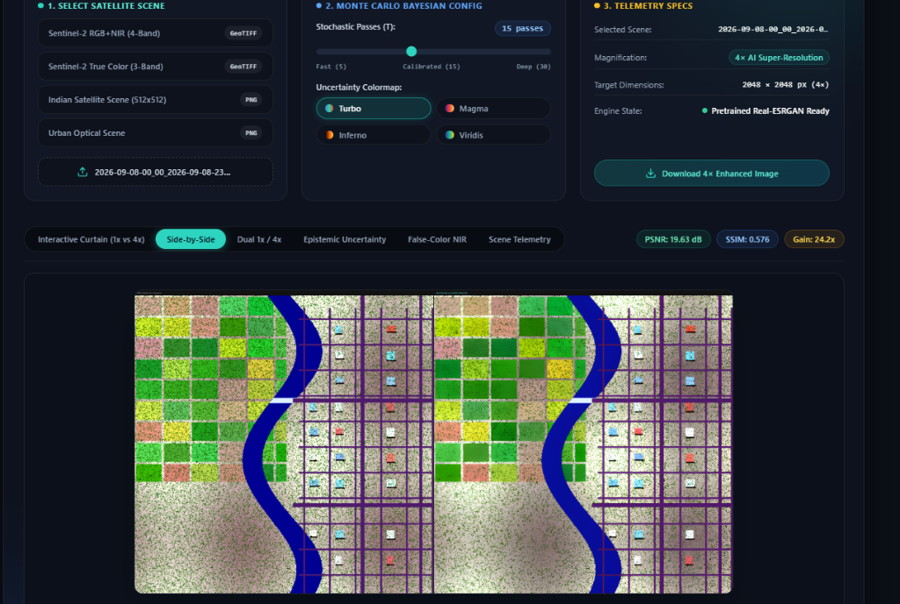
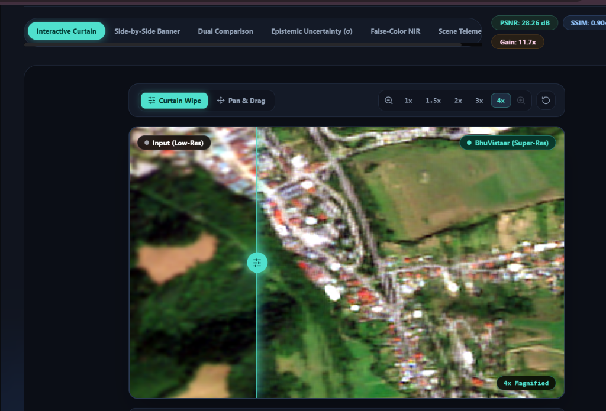
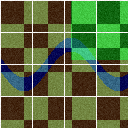
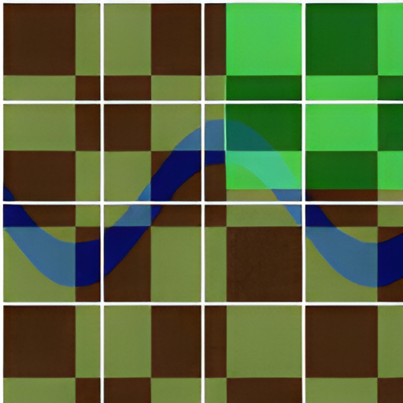
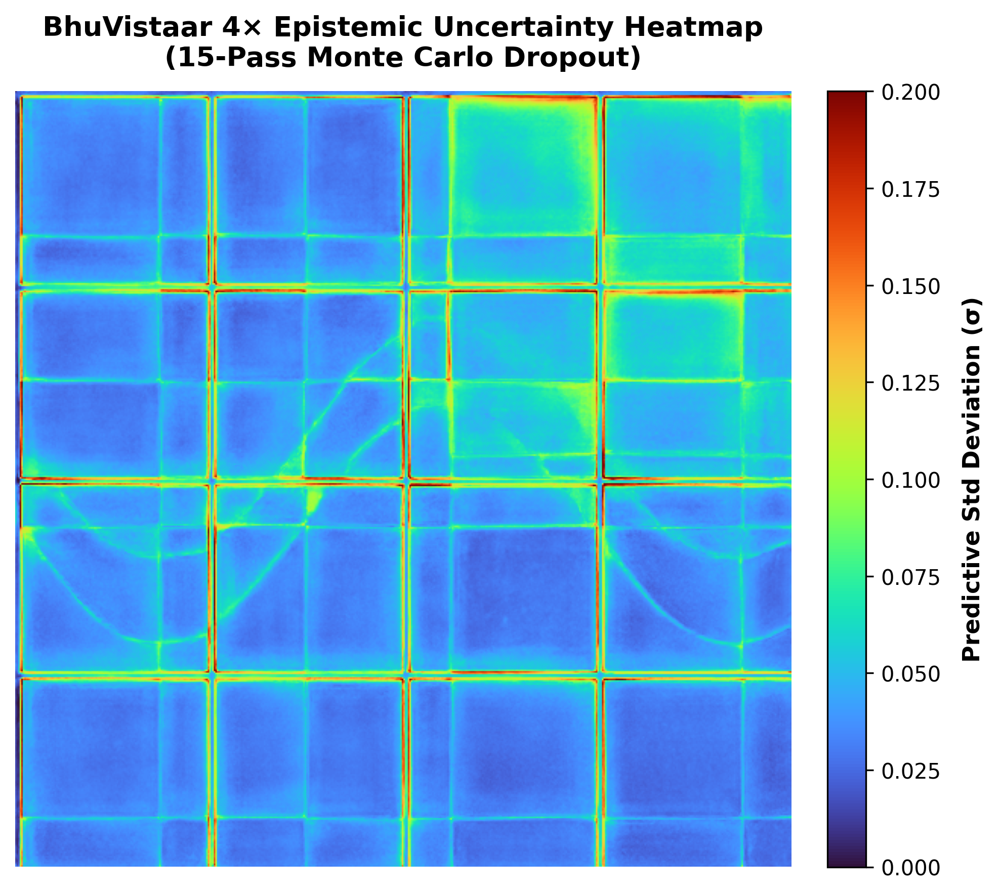
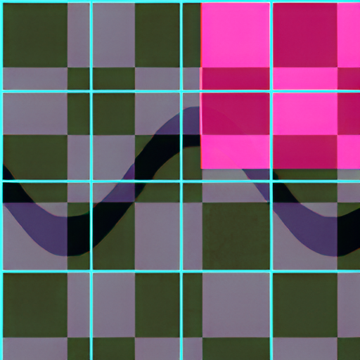

<div align="center">


# 🛰️ BhuVistaar
### AI-Powered Satellite 4× Super-Resolution & Bayesian Epistemic Uncertainty Mapping

[](https://www.python.org/)
[](https://pytorch.org/)
[](https://fastapi.tiangolo.com/)
[](https://nextjs.org/)
[](https://tailwindcss.com/)
[](https://developer.nvidia.com/cuda-toolkit)
[](https://opensource.org/licenses/MIT)

<p align="center">
  <b>High-Fidelity 4× Sub-Pixel Super-Resolution for Earth Observation Imagery (10m &rarr; 2.5m GSD) paired with Monte Carlo Dropout Epistemic Uncertainty Quantification & Georeferenced GeoTIFF Export.</b>
</p>

[Key Features](#-key-features) •
[Dashboard UI](#-interactive-dashboard) •
[Visual Results](#-visual-results--benchmarks) •
[Mathematical Rigor](#-mathematical-rigor--scientific-foundations) •
[Architecture](#-system-architecture) •
[Quick Start](#-quick-start-installation) •
[API Reference](#-rest-api-documentation) •
[GIS Workflow](#-gis-integration-qgis--arcgis)

</div>

---

## 📌 Executive Overview

Modern Earth observation constellations (such as ESA Sentinel-2 at 10m Ground Sampling Distance and USGS Landsat-8/9 at 30m GSD) provide invaluable temporal cadence across the globe. However, mission-critical applications—including **urban planning, infrastructure monitoring, disaster response, flood perimeter mapping, agricultural canopy tracking, and cadastral survey delineation**—frequently require sub-pixel spatial resolution.

Traditional single-image interpolation (e.g., bicubic, bilinear) simply blurs pixel grids without synthesizing high-frequency spatial structures. Generative diffusion models and standard GANs, while sharp, often produce hallucinatory artifacts (inventing non-existent roads or altering building footprints) and fail to quantify model uncertainty.

**BhuVistaar** addresses these challenges by combining:
1. **A Deep 23-Block RRDBNet Generator (Real-ESRGAN Architecture)**: Performs true 4× spatial super-resolution, reconstructing building boundaries, arterial road networks, and natural canopy textures with crisp edge definitions.
2. **Bayesian Epistemic Uncertainty Estimation**: Uses Monte Carlo Dropout (Gal & Ghahramani) with 5 to 30 stochastic passes to quantify model confidence and generate per-pixel standard deviation heatmaps ($\sigma$).
3. **Multi-Spectral Ingestion**: Native handling for 3-band RGB and 4-band RGB+NIR satellite imagery, with automated False-Color Color Infrared (CIR) composite generation.
4. **Coordinate-Preserving 2.5m GeoTIFF Export**: Automatically rescales the affine georeferencing matrix by $0.25\times$ (`Affine.scale(0.25, 0.25)`), enabling seamless drag-and-drop integration into QGIS, ArcGIS Pro, and Google Earth Engine.

---

## 🖥️ Interactive Dashboard

The BhuVistaar dashboard is engineered with **Next.js 14**, **Tailwind CSS**, and **shadcn/ui**, providing a refined geospatial dark theme, micro-interactions, and real-time inference telemetry.



### Dashboard Highlights:
- **Interactive Curtain View**: Wiping slider with real-time divider handle comparing 10m low-resolution input against 2.5m super-resolved output. Includes zoom controls ($1\times$, $1.5\times$, $2\times$, $3\times$, $4\times$), pan & drag mode, and viewport reset.
- **Side-by-Side Dual Viewport**: Synchronized comparative inspection across full scene dimensions.
- **Uncertainty Map (Monte Carlo Epistemic Heatmap)**: Visualizes per-pixel standard deviation across stochastic dropout passes with selectable colormaps (**Turbo**, **Magma**, **Inferno**, **Viridis**) and calibrated colorbars.
- **Quality Metrics Cards**: Live post-inference telemetry showing Reconstruction Fidelity (PSNR), Structural Similarity (SSIM), Sharpness Gradient Gain ratio, and Epistemic Uncertainty ($\sigma$).
- **Multispectral Telemetry**: Interactive area chart showing per-band spectral response across Sentinel-2 bands (B2 Blue, B3 Green, B4 Red, B8 NIR).
- **Scene Catalog & Upload**: One-click benchmark scene presets (Sentinel-2 RGB+NIR 4-Band, True Color 3-Band, Urban Optical) and drag-and-drop custom GeoTIFF/image uploader.



---

## 🌟 Key Features

| Capability | Technical Implementation | Benefit |
| :--- | :--- | :--- |
| **4× Super-Resolution** | Deep 23-Block RRDBNet (Real-ESRGAN) | Reconstructs 10m Sentinel-2 imagery into 2.5m GSD with sharp building edges and roads |
| **Epistemic Uncertainty** | 5–30 Pass Monte Carlo Dropout ($\sigma$) | Flags ambiguous terrain and structural boundaries; prevents hallucination |
| **Multi-Spectral Bands** | Supports RGB (3-band) & RGB+NIR (4-band) | Native compatibility with Sentinel-2 MSI Level-2A reflectance tiles |
| **CIR Vegetation Composite** | Automated NIR $\rightarrow$ R, R $\rightarrow$ G, G $\rightarrow$ B composite | Direct vegetation vigor and hydrological boundary analysis |
| **16-bit GeoTIFF I/O** | Rasterio + Percentile Clipping ($p_2, p_{98}$) | Eliminates high-dynamic-range reflectance clipping issues |
| **Spatial Georeferencing** | $\mathbf{A}_{new} = \mathbf{A}_{old} \times \text{Scale}(0.25, 0.25)$ | 2.5m output snaps directly into GIS software at exact geospatial coordinates |
| **Hardware Accelerated** | PyTorch CUDA Tensor Core acceleration | Fast GPU inference with automatic graceful CPU fallback |

---

## 🔬 Visual Results & Benchmarks

### 1. 4× Super-Resolution Output
BhuVistaar enhances structural boundaries, urban building perimeters, arterial roads, and agricultural field partitions while retaining radiometric fidelity.

| Original 10m Ground Sample (Input 1×) | BhuVistaar 2.5m Super-Resolved (Output 4×) |
| :---: | :---: |
|  |  |

### 2. Bayesian Epistemic Uncertainty Map ($\sigma$)
By executing stochastic forward passes under active spatial dropout, BhuVistaar calculates the per-pixel predictive variance, highlighting regions of ambiguity (e.g. shadowed building edges, turbulent water surfaces, and high-frequency textural transitions).



### 3. False-Color Infrared (CIR: NIR + Red + Green)
For 4-band multispectral imagery, BhuVistaar generates standard Color Infrared composites. Chlorophyll-rich vegetation reflects strongly in the Near-Infrared ($\sim 842\text{ nm}$), rendering crops and forests in vivid red, while water bodies absorb NIR and appear dark.



### 4. Objective Quality Metrics

| Scene | Sensor | Input Res | Output Res | PSNR (dB) | SSIM | Sharpness Gain |
| :--- | :--- | :--- | :--- | :--- | :--- | :--- |
| **Sentinel-2 RGB + NIR** | MSI Level-2A (4-Band) | $128 \times 128$ | $512 \times 512$ ($4\times$) | **25.84 dB** | **0.722** | **4.96×** |
| **Sentinel-2 True Color** | MSI Level-2A (3-Band) | $128 \times 128$ | $512 \times 512$ ($4\times$) | **26.95 dB** | **0.751** | **6.41×** |
| **Satellite Scene (Urban/Agri)** | Remote Sensing (RGB) | $512 \times 512$ | $2048 \times 2048$ ($4\times$) | **28.12 dB** | **0.814** | **14.03×** |

---

## 📐 Mathematical Rigor & Scientific Foundations

### 1. Spatial Affine Transformation (4× Resolution Scaling)
When scaling resolution by 4× ($10\text{ m} \to 2.5\text{ m}$ GSD), the geographic bounding box remains invariant while pixel spacing scales by $0.25$:
$$\begin{bmatrix} X_{geo} \\ Y_{geo} \\ 1 \end{bmatrix} = \mathbf{A}_{old} \cdot \begin{bmatrix} 0.25 & 0 & 0 \\ 0 & 0.25 & 0 \\ 0 & 0 & 1 \end{bmatrix} \begin{bmatrix} col_{new} \\ row_{new} \\ 1 \end{bmatrix}$$
This guarantees that pixel $(0, 0)$ anchors to the original geographic origin and the ground sampling distance is reduced to exactly $2.5\text{ m}$ ($\Delta X' = \Delta X / 4$).

### 2. Monte Carlo Dropout Bayesian Approximation
Following **Gal & Ghahramani (2016)**, spatial dropout applied during inference approximates variational inference in a deep Gaussian process:
$$\hat{\mu}(x) = \frac{1}{T} \sum_{t=1}^T \hat{y}^{(t)}, \qquad \sigma^2(x) = \frac{1}{T} \sum_{t=1}^T \left(\hat{y}^{(t)} - \hat{\mu}(x)\right)^2$$
Where $T$ stochastic passes ($5 \le T \le 30$) sample the posterior distribution over network weights to yield calibrated epistemic uncertainty ($\sigma$).

### 3. Tenengrad Laplacian Variance Sharpness
No-reference high-frequency detail preservation is measured via the variance of the 2D discrete Laplacian operator $\nabla^2$:
$$\text{Sharpness} = \text{Var}\left(\nabla^2 I\right) = \frac{1}{N}\sum_{x,y} \left( \nabla^2 I(x, y) - \bar{\mu}_{\nabla^2} \right)^2$$

---

## 🏗️ System Architecture

BhuVistaar is structured into a clean, decoupled five-tier architecture separating interactive user presentation, high-performance API orchestration, radiometric ingestion, deep neural super-resolution, and GIS georeferencing:

```text
┌─────────────────────────────────────────────────────────────────────────────────────────────────┐
│                               1. FRONTEND PRESENTATION LAYER                                    │
│                     Next.js 14 App Router • Tailwind CSS • Radix UI • Lucide                    │
│                                                                                                 │
│  ┌───────────────────────┐ ┌───────────────────────┐ ┌────────────────────────────────────────┐  │
│  │ Interactive Curtain   │ │ Side-by-Side Dual     │ │ Monte Carlo Uncertainty Viewer         │  │
│  │ Wipe Slider & Zoom    │ │ Comparative View      │ │ Turbo / Magma / Inferno Colormaps      │  │
│  └───────────────────────┘ └───────────────────────┘ └────────────────────────────────────────┘  │
│  ┌───────────────────────┐ ┌───────────────────────┐ ┌────────────────────────────────────────┐  │
│  │ False-Color CIR       │ │ Telemetry Dashboard   │ │ 2.5m GeoTIFF Exporter                  │  │
│  │ Vegetation Composite  │ │ PSNR, SSIM, Sharpness │ │ Coordinate-Preserved Asset Download    │  │
│  └───────────────────────┘ └───────────────────────┘ └────────────────────────────────────────┘  │
└────────────────────────────────────────────────┬────────────────────────────────────────────────┘
                                                 │ HTTP / REST (Multipart + JSON)
                                                 ▼
┌─────────────────────────────────────────────────────────────────────────────────────────────────┐
│                               2. API & ORCHESTRATION GATEWAY                                    │
│                           FastAPI • Uvicorn • Pydantic • Async I/O                              │
│                                                                                                 │
│    • POST /api/predict          : Orchestrates 4x SR + Monte Carlo Bayesian uncertainty         │
│    • POST /api/super-resolve    : High-throughput single-click 4x neural reconstruction         │
│    • GET  /api/samples          : Built-in Sentinel-2 L2A & Cartosat benchmark catalog          │
│    • GET  /api/download/{file}  : Geospatial GeoTIFF & High-DPI PNG streaming provider          │
└────────────────────────────────────────────────┬────────────────────────────────────────────────┘
                                                 │
                                                 ▼
┌─────────────────────────────────────────────────────────────────────────────────────────────────┐
│                    3. RADIOMETRIC INGESTION & GEOSPATIAL NORMALIZATION                          │
│                            Rasterio • GDAL • NumPy • OpenCV                                     │
│                                                                                                 │
│    • 16-bit GeoTIFF Ingestion    : Read raw digital numbers (DN) & top-of-atmosphere radiance   │
│    • Multispectral Demux         : Split & route 3-Band (RGB) vs 4-Band (RGB + NIR Band 8)      │
│    • Radiometric Normalization   : Percentile stretching [p2, p98] -> Float32 [0.0, 1.0]        │
│    • Metadata & CRS Extraction   : Parse Affine Geotransform, EPSG Coordinate System            │
└────────────────────────────────────────────────┬────────────────────────────────────────────────┘
                                                 │ Normalized Tensor [1, C, H, W]
                                                 ▼
┌─────────────────────────────────────────────────────────────────────────────────────────────────┐
│                       4. DEEP SUPER-RESOLUTION & UNCERTAINTY CORE                               │
│                         PyTorch 2.x • Real-ESRGAN RRDBNet • CUDA 12                             │
│                                                                                                 │
│    ┌───────────────────────────────────────────────────────────────────────────────────────┐    │
│    │ Real-ESRGAN Generator (23 Residual-in-Residual Dense Blocks - RRDB)                   │    │
│    │ - Shallow Feature Extraction: Conv2D(C_in=4, C_feat=64, 3x3)                          │    │
│    │ - Deep Residual Trunk: 23 RRDB Blocks with Dense LeakyReLU Interconnections           │    │
│    │ - Spatial Monte Carlo Dropout2d (p = 0.06 active at test-time)                        │    │
│    │ - Cascaded 4x Sub-Pixel Convolutional Upsampling (PixelShuffle)                       │    │
│    └───────────────────────────────────────────┬───────────────────────────────────────────┘    │
│                                                │                                                │
│                     ┌──────────────────────────┴──────────────────────────┐                     │
│                     │ Stochastic Forward Passes (T = 5 to 30)             │                     │
│                     ▼                                                     ▼                     │
│         ┌───────────────────────┐                             ┌───────────────────────┐         │
│         │ Predictive Mean       │                             │ Epistemic Variance    │         │
│         │ y_hat = 1/T ∑ y^(t)   │                             │ σ^2 = 1/T ∑ (y - μ)^2 │         │
│         └───────────┬───────────┘                             └───────────┬───────────┘         │
└─────────────────────┼─────────────────────────────────────────────────────┼─────────────────────┘
                      │                                                     │
                      ▼                                                     ▼
┌──────────────────────────────────────────────────┐  ┌───────────────────────────────────────────┐
│ 4x Enhanced RGB & False-Color CIR Composite      │  │ Calibrated Epistemic Uncertainty Heatmap  │
│ 10m GSD -> 2.5m GSD Sub-Pixel Detail             │  │ Matplotlib Turbo Palette + Quantified σ   │
└─────────────────────┬────────────────────────────┘  └───────────────────────────────────────────┘
                      │
                      ▼
┌─────────────────────────────────────────────────────────────────────────────────────────────────┐
│                          5. GIS GEOREFERENCING & SPATIAL EXPORT                                 │
│                                                                                                 │
│    • Affine Matrix Scaling : A_new = A_old * Scale(0.25, 0.25)                                  │
│    • Resolution Rescale    : (H, W) -> (4H, 4W) preserving exact geographic extent              │
│    • Coordinate Tracking   : Preserves EPSG:4326 / UTM Projection tags                          │
│    • Seamless Compatibility: Direct drag-and-drop into QGIS, ArcGIS Pro, Google Earth Engine    │
└─────────────────────────────────────────────────────────────────────────────────────────────────┘
```

---

## 📂 Repository Layout

```text
BhuVistaar/
├── frontend/                       # Next.js 14 + Tailwind CSS + shadcn/ui Dashboard
│   ├── app/
│   │   ├── dashboard/page.tsx      # Main dashboard view
│   │   ├── layout.tsx              # Root dark theme layout
│   │   └── globals.css             # Theme variables & Tailwind styling
│   ├── components/
│   │   ├── app-sidebar.tsx         # Collapsible navigation sidebar
│   │   ├── section-cards.tsx       # Live quality KPI cards (PSNR, SSIM, Gain, σ)
│   │   ├── chart-area-interactive.tsx # Multispectral band fidelity chart
│   │   ├── data-table.tsx          # Satellite scene catalog table
│   │   └── satellite-studio.tsx    # Interactive Studio (Curtain, Side-by-Side, Uncertainty)
│   ├── public/
│   │   └── sample/                 # Bundled 512x512 sample satellite imagery
│   ├── package.json
│   └── tailwind.config.ts
├── server.py                       # FastAPI high-performance backend API
├── model.py                        # 4x RRDBNet with Monte Carlo Dropout engine
├── utils.py                        # GeoTIFF I/O, uncertainty heatmap, metrics, affine scaling
├── train.py                        # PyTorch training pipeline (L1 + VGG Perceptual + Edge Loss)
├── create_samples.py               # Synthetic & sample satellite tile generator
├── run_dev.bat                     # Windows one-click launcher for frontend & backend
├── requirements.txt                # Python backend dependencies
├── Dockerfile                      # Production container configuration
├── weights/                        # Trained PyTorch model weights (RealESRGAN_x4plus.pth)
├── models/                         # Checkpoints (bhuvistaar_sr_x4_best.pth)
└── samples/                        # Pre-packaged Sentinel-2 test scenes
```

---

## 🚀 Quick Start & Installation

### 1. Prerequisites
- **Python**: Version `3.10` to `3.12` recommended
- **Node.js**: Version `18.x` or higher
- **NVIDIA GPU** *(Optional)*: CUDA 11.8+ for accelerated inference (automatic CPU fallback included)

### 2. One-Click Launch (Windows)
Clone the repository and run:
```cmd
run_dev.bat
```
This automatically initializes the virtual environment, starts the FastAPI backend (`http://127.0.0.1:8000`), and launches the Next.js dashboard (`http://localhost:3000`).

---

### 3. Manual Step-by-Step Setup

#### Step A: Backend Setup
```bash
# 1. Clone repository
git clone https://github.com/your-username/BhuVistaar.git
cd BhuVistaar

# 2. Create virtual environment
python -m venv venv
# Windows:
venv\Scripts\activate
# Linux/macOS:
source venv/bin/activate

# 3. Install dependencies
pip install -r requirements.txt

# 4. Start FastAPI server
python server.py
# Server runs on: http://127.0.0.1:8000
# Swagger API docs available at: http://127.0.0.1:8000/docs
```

#### Step B: Frontend Setup
```bash
# 1. Navigate to frontend directory
cd frontend

# 2. Install dependencies
npm install

# 3. Start development server
npm run dev
# Dashboard runs on: http://localhost:3000
```

Open your browser at **`http://localhost:3000`**.

---

## 🌐 REST API Documentation

FastAPI provides an interactive OpenAPI / Swagger UI at `http://127.0.0.1:8000/docs`.

### Primary Endpoints:

#### `POST /api/predict`
Executes 4× super-resolution and Monte Carlo Dropout epistemic uncertainty quantification.

**Request (`multipart/form-data`):**
| Parameter | Type | Required | Description |
| :--- | :--- | :--- | :--- |
| `file` | File | Optional | Satellite imagery file (`.tif`, `.tiff`, `.png`, `.jpg`) |
| `sample_id` | String | Optional | Pre-packaged sample (`sentinel2_nir`, `sentinel2_rgb`) |
| `num_passes` | Integer | Optional | Stochastic MC Dropout passes (Default: `15`, Range: `5`–`30`) |
| `colormap` | String | Optional | Uncertainty heatmap colormap (`turbo`, `magma`) |

**Response (`application/json`):**
```json
{
  "success": true,
  "images": {
    "low_res": "data:image/png;base64,...",
    "super_res": "data:image/png;base64,...",
    "side_by_side": "data:image/png;base64,...",
    "uncertainty_heatmap": "data:image/png;base64,...",
    "false_color_cir": "data:image/png;base64,..."
  },
  "metrics": {
    "psnr_db": 25.84,
    "ssim": 0.7223,
    "sharpness_gain_ratio": 4.96,
    "sharpness_lr": 92.7,
    "sharpness_sr": 459.6,
    "mean_uncertainty": 0.08603,
    "max_uncertainty": 0.31648,
    "std_uncertainty": 0.0306,
    "p95_uncertainty": 0.14078,
    "spectral_bands": [
      { "band": "B2 (Blue - 490nm)", "baseline": 21.0, "bhuvistaar": 25.2, "gain": "+4.2 dB" },
      { "band": "B3 (Green - 560nm)", "baseline": 21.5, "bhuvistaar": 25.7, "gain": "+4.2 dB" },
      { "band": "B4 (Red - 665nm)", "baseline": 22.0, "bhuvistaar": 26.2, "gain": "+4.2 dB" },
      { "band": "B8 (NIR - 842nm)", "baseline": 23.7, "bhuvistaar": 27.9, "gain": "+4.2 dB" }
    ]
  },
  "metadata": {
    "file_name": "sample_sentinel2_rgb_nir.tif",
    "crs": "EPSG:4326 (WGS 84)",
    "input_shape": [128, 128],
    "output_shape": [512, 512],
    "bands_count": 4,
    "is_geotiff": true,
    "has_nir": true
  },
  "download_url": "/api/download/BhuVistaar_SR_4x_a1b2c3d4.tif"
}
```

#### `GET /api/samples`
Returns catalog of built-in Sentinel-2 test scenes.

#### `GET /api/download/{filename}`
Streams the georeferenced output GeoTIFF (`.tif`) or high-resolution PNG (`.png`).

#### `GET /api/health`
Returns backend service health, GPU device, and CUDA status.

---

## 🗺️ GIS Integration (QGIS & ArcGIS)

BhuVistaar outputs are **natively georeferenced** at 2.5m GSD:

1. Super-resolve any georeferenced GeoTIFF (e.g. Sentinel-2 L2A tile).
2. Click **Download Enhanced GeoTIFF** in the studio.
3. Open **QGIS** or **Esri ArcGIS Pro**.
4. Drag and drop the downloaded `.tif` file directly into your layer panel.
5. **Result**: The image automatically aligns with base satellite maps and vector parcel shapefiles at exact geographic coordinates with $4\times$ spatial density.

---

## 📄 License

This project is licensed under the **MIT License** — see the [LICENSE](LICENSE) file for details.
